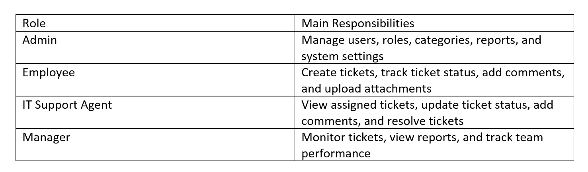

# Requirements Specification

## 1. Project Scope

The IT Help Desk & Ticketing Management System is a web-based platform designed to manage technical support requests inside an organization.

The system allows employees to submit IT support tickets, while IT support agents can manage, prioritize, assign, and resolve those tickets. Administrators manage users, roles, categories, reports, and system settings.

---

## 2. System Users

## 3. Functional Requirements

### Authentication & User Management

- The system shall allow users to register and log in.
- The system shall encrypt user passwords.
- The system shall support role-based access control.
- The system shall allow users to manage their profiles.
- The system shall protect private pages and API routes.

### Ticket Management

- The system shall allow employees to create support tickets.
- The system shall allow users to view ticket details.
- The system shall allow tickets to be updated.
- The system shall support ticket categories such as Hardware, Software, Network, Email, Access Request, and Other.
- The system shall support ticket priorities: Low, Medium, High, and Critical.
- The system shall support ticket statuses: Open, In Progress, Pending, Resolved, and Closed.
- The system shall generate a unique ticket reference number.
- The system shall support searching and filtering tickets.

### Ticket Assignment & Workflow

- The system shall allow authorized users to assign tickets to IT support agents.
- The system shall allow tickets to be reassigned.
- The system shall track assignment history.
- The system shall keep an audit trail of ticket actions.
- The system shall allow internal notes for support agents.

### Communication & Notifications

- The system shall allow users to add comments to tickets.
- The system shall notify users when ticket status changes.
- The system shall provide in-app notifications.
- Email notifications may be added as an advanced feature.

### Dashboard & Reporting

- The system shall display the number of open, pending, and resolved tickets.
- The system shall show tickets by category and priority.
- The system shall provide reports for ticket activity.
- The system may support exporting reports to PDF or Excel.

### File Attachments

- The system shall allow users to upload screenshots or documents to tickets.
- The system shall validate file size.
- The system shall validate supported file types.
- The system shall store uploaded files securely.

### Admin Panel

- The system shall allow admins to manage users.
- The system shall allow admins to manage roles.
- The system shall allow admins to manage ticket categories.
- The system shall allow admins to view activity logs.
- The system shall restrict admin features to authorized users only.

### Optional AI Features

- The system may suggest a ticket category based on ticket description.
- The system may suggest ticket priority based on urgency.
- The system may generate suggested replies for support agents.
- The system may include an AI chat assistant for employees.

---

## 4. Non-Functional Requirements

### Security

- Passwords must be securely hashed.
- API routes must be protected using token-based authentication.
- Users must only access features allowed by their role.
- Uploaded files must be validated before storage.

### Performance

- The system should load pages quickly.
- Ticket search and filtering should be efficient.
- Dashboard statistics should be generated without unnecessary delay.

### Usability

- The interface should be simple and easy to use.
- The system should be responsive and mobile-friendly.
- Forms should show clear validation messages.

### Reliability

- The system should handle errors gracefully.
- Important user actions should be logged.
- The system should preserve ticket history.

### Maintainability

- The backend should follow a clean REST API structure.
- The frontend and backend should be separated clearly.
- The project should use GitHub branches and pull requests.
- Documentation should be updated throughout development.

---

## 5. System Constraints

- The backend will be developed using PHP Laravel.
- The frontend will be developed using React.js.
- The database will use MySQL.
- The system will follow RESTful API design.
- The project will be developed collaboratively using GitHub.

---

## 6. Assumptions

- Each user has one main role.
- Employees can only track their own submitted tickets.
- IT support agents can view and update tickets assigned to them.
- Admins have full system access.
- Managers can view reports but cannot change system settings.
- Optional AI features may be implemented after the core system is completed.

---

## 7. Week 1 Deliverables Related to Requirements

- Requirement analysis
- System scope definition
- User roles and permissions
- Functional requirements
- Non-functional requirements
- Initial project documentation