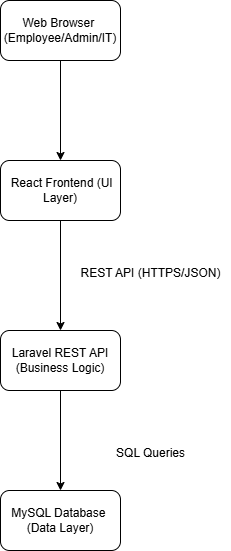

# System Architecture

## 1. Architecture Overview

The IT Help Desk & Ticketing Management System will follow a three-layer web application architecture:

1. Frontend Layer
2. Backend API Layer
3. Database Layer

The frontend will be built using React.js and will communicate with the backend through RESTful APIs. The backend will be built using PHP Laravel and will handle authentication, business logic, ticket management, file uploads, notifications, and reporting. The database will use MySQL to store users, tickets, comments, attachments, notifications, roles, categories, priorities, statuses, and activity logs.

---

**Figure 1.** High-Level System Architecture of the IT Help Desk & Ticketing Management System.

The diagram above illustrates the overall architecture of the IT Help Desk & Ticketing Management System.

The system follows a three-layer architecture:

- **Frontend Layer (React.js):** Provides the user interface where employees, IT support agents, managers, and administrators interact with the system.
- **Backend Layer (Laravel):** Processes business logic, authentication, ticket management, notifications, file uploads, and reporting through RESTful APIs.
- **Database Layer (MySQL):** Stores all application data, including users, tickets, comments, categories, notifications, and activity logs.

This architecture separates the presentation layer, business logic, and data storage, making the application scalable, maintainable, and secure.

## 3. Frontend Architecture
The frontend of the IT Help Desk & Ticketing Management System will be developed using **React.js**.

It provides the graphical user interface (GUI) that allows users to interact with the application through a web browser.

The frontend communicates with the backend using RESTful APIs and displays data returned from the Laravel server.

### Main Responsibilities

- User authentication (Login & Logout)
- Dashboard interface
- Ticket creation
- Ticket tracking
- Ticket search and filtering
- Viewing notifications
- Profile management
- Responsive user interface

### Technologies

- React.js
- Tailwind CSS
- Axios
- React Router

**Figure 2.** Frontend Architecture.
## 4. Backend Architecture

The backend of the system will be developed using **PHP Laravel**. It will act as the main REST API layer between the React frontend and the MySQL database.

The backend is responsible for processing requests, applying business rules, validating data, securing routes, and returning responses to the frontend.

### Main Responsibilities

- User registration and login
- Token-based authentication using Laravel Sanctum
- Role-based access control
- Ticket creation, update, deletion, and retrieval
- Ticket assignment to IT support agents
- Ticket comments and internal notes
- File upload validation and storage
- Notification management
- Dashboard statistics and reports
- Activity logging

### Technologies

- PHP
- Laravel
- Laravel Sanctum
- Laravel Eloquent ORM
- Laravel Middleware
- MySQL connection

## 5. Database Architecture

The database layer will use **MySQL** to store all persistent system data.

The database will contain relational tables connected using primary keys and foreign keys. This allows the system to track users, tickets, comments, attachments, notifications, roles, categories, priorities, statuses, and activity logs.

### Main Tables

- Users
- Roles
- Tickets
- TicketComments
- TicketAttachments
- Notifications
- Categories
- Priorities
- Statuses
- ActivityLogs

The database schema and ERD will be prepared separately inside the database documentation section.

## 6. Conclusion

The IT Help Desk & Ticketing Management System follows a modern three-layer architecture consisting of a React frontend, a Laravel backend, and a MySQL database. This architecture separates the presentation layer, business logic, and data storage, making the system scalable, secure, and maintainable. It also provides a solid foundation for implementing the planned features in the development phase.