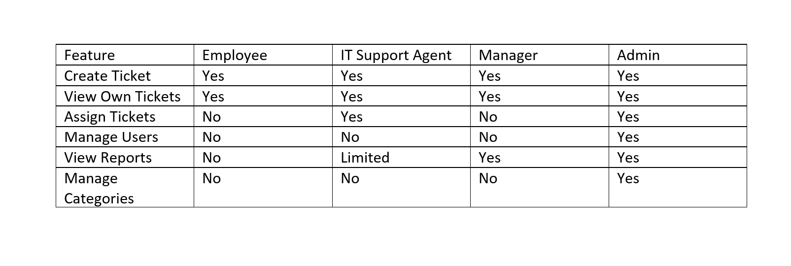

# API Design

## 1. Overview

This document defines the planned RESTful APIs for the IT Help Desk & Ticketing Management System.

The backend will be developed using **PHP Laravel** and will provide API endpoints for authentication, user management, ticket management, comments, attachments, notifications, dashboard statistics, and reports.

The frontend React application will communicate with these APIs using HTTP requests.

**Base API URL**

```text
/api
```

---

# 2. Authentication APIs

## Register User

**Endpoint**

```http
POST /api/register
```

### Request Body

```json
{
  "name": "Employee Name",
  "email": "employee@example.com",
  "password": "password",
  "password_confirmation": "password"
}
```

### Response

```json
{
  "message": "User registered successfully"
}
```

---

## Login User

**Endpoint**

```http
POST /api/login
```

### Request Body

```json
{
  "email": "employee@example.com",
  "password": "password"
}
```

### Response

```json
{
  "token": "access_token",
  "user": {
    "id": 1,
    "name": "Employee Name",
    "email": "employee@example.com",
    "role": "Employee"
  }
}
```

---

## Logout User

**Endpoint**

```http
POST /api/logout
```

**Authorization Required:** Yes

### Response

```json
{
  "message": "Logged out successfully"
}
```

---

# 3. User APIs

## Get User Profile

**Endpoint**

```http
GET /api/profile
```

**Authorization Required:** Yes

### Response

```json
{
  "id": 1,
  "name": "Employee Name",
  "email": "employee@example.com",
  "role": "Employee"
}
```

---

## Update User Profile

**Endpoint**

```http
PUT /api/profile
```

### Request Body

```json
{
  "name": "Updated Name",
  "email": "updated@example.com"
}
```

### Response

```json
{
  "message": "Profile updated successfully"
}
```
---

# 4. Ticket APIs

## Get Tickets

**Endpoint**

```http
GET /api/tickets
```

**Authorization Required:** Yes

### Filters

```text
/api/tickets?status=Open
/api/tickets?priority=High
/api/tickets?category=Software
```

### Response

```json
[
  {
    "id": 1,
    "reference_number": "TCK-0001",
    "title": "Outlook not working",
    "category": "Software",
    "priority": "High",
    "status": "Open",
    "created_by": "Employee Name",
    "assigned_to": "Support Agent"
  }
]
```

---

## Create Ticket

**Endpoint**

```http
POST /api/tickets
```

**Authorization Required:** Yes

### Request Body

```json
{
  "title": "Outlook not working",
  "description": "Outlook crashes when opening emails.",
  "category_id": 2,
  "priority_id": 3
}
```

### Response

```json
{
  "message": "Ticket created successfully",
  "ticket_reference": "TCK-0001"
}
```

---

## Get Ticket Details

**Endpoint**

```http
GET /api/tickets/{id}
```

**Authorization Required:** Yes

---

## Update Ticket

**Endpoint**

```http
PUT /api/tickets/{id}
```

**Authorization Required:** Yes

---

## Delete / Cancel Ticket

**Endpoint**

```http
DELETE /api/tickets/{id}
```

**Authorization Required:** Yes

---

# 5. Ticket Assignment APIs

## Assign Ticket

**Endpoint**

```http
POST /api/tickets/{id}/assign
```

**Authorization Required:** Admin / IT Support Agent

### Request Body

```json
{
  "agent_id": 5
}
```

### Response

```json
{
  "message": "Ticket assigned successfully"
}
```

---

## Reassign Ticket

**Endpoint**

```http
PUT /api/tickets/{id}/reassign
```

**Authorization Required:** Admin / IT Support Agent

### Request Body

```json
{
  "agent_id": 8
}
```

### Response

```json
{
  "message": "Ticket reassigned successfully"
}
```

---

# 6. Ticket Comment APIs

## Add Comment

**Endpoint**

```http
POST /api/tickets/{id}/comments
```

### Request Body

```json
{
  "comment": "Please restart Outlook and try again."
}
```

### Response

```json
{
  "message": "Comment added successfully"
}
```

---

## Get Ticket Comments

**Endpoint**

```http
GET /api/tickets/{id}/comments
```

---

# 7. File Attachment APIs

## Upload Attachment

**Endpoint**

```http
POST /api/tickets/{id}/attachments
```

**Content Type**

```text
multipart/form-data
```

---

## Download Attachment

**Endpoint**

```http
GET /api/attachments/{id}/download
```

---

# 8. Notification APIs

## Get Notifications

**Endpoint**

```http
GET /api/notifications
```

---

## Mark Notification as Read

**Endpoint**

```http
PUT /api/notifications/{id}/read
```
---

# 9. Dashboard APIs

## Get Dashboard Statistics

**Endpoint**

```http
GET /api/dashboard/stats
```

**Authorization Required:** Yes

### Response

```json
{
  "open_tickets": 10,
  "pending_tickets": 4,
  "resolved_tickets": 25,
  "critical_tickets": 2
}
```

---

# 10. Admin APIs

## Get All Users

**Endpoint**

```http
GET /api/admin/users
```

**Authorization Required:** Admin

---

## Update User Role

**Endpoint**

```http
PUT /api/admin/users/{id}/role
```

**Authorization Required:** Admin

### Request Body

```json
{
  "role_id": 2
}
```

---

## Manage Categories

**Endpoints**

```http
GET /api/admin/categories
POST /api/admin/categories
PUT /api/admin/categories/{id}
DELETE /api/admin/categories/{id}
```

**Authorization Required:** Admin

---

# 11. Reports APIs

## Get Monthly Ticket Report

**Endpoint**

```http
GET /api/reports/monthly
```

**Authorization Required:** Admin / Manager

---

## Export Report

**Endpoint**

```http
GET /api/reports/export
```

Example:

```text
/api/reports/export?format=pdf
/api/reports/export?format=excel
```

---

# 12. Authorization Matrix



---

# 13. Standard API Response Format

## Success Response

```json
{
  "success": true,
  "message": "Operation completed successfully",
  "data": {}
}
```

## Error Response

```json
{
  "success": false,
  "message": "Something went wrong",
  "errors": {}
}
```

---

# 14. Common HTTP Status Codes

Status Code => Meaning 
 200 => Request successful 
 201 => Resource created 
 400 => Bad request 
 401 => Unauthorized 
 403 => Forbidden 
 404 => Resource not found 
 422 => Validation error 
 500 => Server error 

---

# 15. Conclusion

This API design defines the main backend endpoints required for the IT Help Desk & Ticketing Management System.

It will guide the Laravel backend implementation and help the React frontend team understand how to communicate with the backend API.