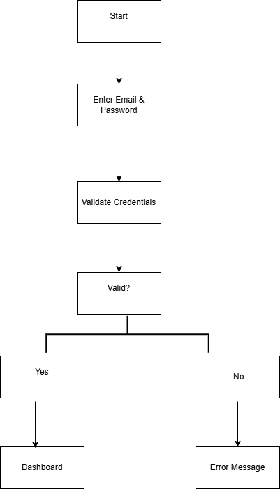
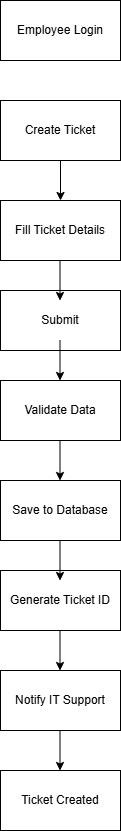
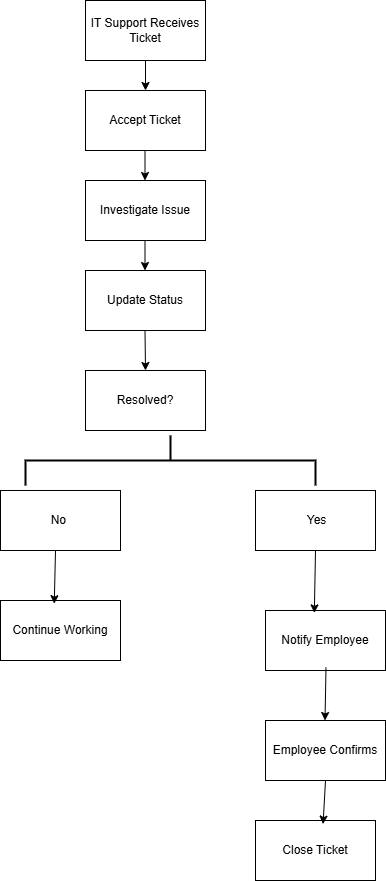

# Workflow Diagrams

## 1. Introduction

This document presents the main workflows of the **IT Help Desk & Ticketing Management System**. These workflows describe the sequence of actions performed by users and the system during common operations.

The workflow diagrams were created using **Draw.io** and represent the core business processes of the application.

---

# 2. User Login Workflow

The User Login Workflow illustrates the authentication process for all users. The system validates the entered credentials and grants access according to the user's role.

**Figure 1.** User Login Workflow.

---

# 3. Create Ticket Workflow

The Create Ticket Workflow describes the process an employee follows to submit a new IT support request. After validation, the ticket is stored in the database, assigned a unique reference number, and becomes available to the IT support team.

**Figure 2.** Create Ticket Workflow.

---

# 4. Ticket Resolution Workflow

The Ticket Resolution Workflow illustrates how an IT support agent processes an assigned ticket. The agent investigates the issue, updates the ticket status throughout the process, resolves the problem, and finally closes the ticket after notifying the employee.

**Figure 3.** Ticket Resolution Workflow.

---

# 5. Conclusion

These workflow diagrams provide a visual representation of the main business processes of the IT Help Desk & Ticketing Management System. They help developers and stakeholders understand how users interact with the system and will serve as a reference during the implementation phase.git status